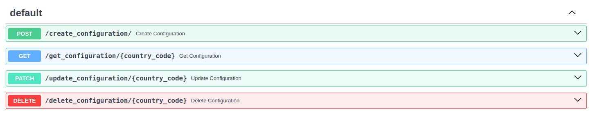

# API Documentation

Fast api has its auto generated api documentation which can be find at http://127.0.0.1:8000/docs



## 

## Testing APIs

<br/> 

Steps to test the APIs :

### Start the server

```bash
uvicorn main:app --reload
```

<br/> 

### Now we can use the following curl commands to test our API endpoints, i have tested them using Postman:

<br/> 

1. **Create Configuration**:

    `curl -X POST "http://127.0.0.1:8000/create_configuration" -H "Content-Type: application/json" -d '{"country_code": "IN", "business_name": "Test Business", "registration_number": "1234567890", "extra_details": {"key": "value"}}'`

<br/> 

2. **Get Configuration**:

    `curl -X GET "http://127.0.0.1:8000/get_configuration/IN"`

<br/> 

3. **Update Configuration**:

    `curl -X PATCH "http://127.0.0.1:8000/update_configuration/IN" -H "Content-Type: application/json" -d '{"business_name": "Updated Business Name"}'`

<br/> 

4. **Delete Configuration**:

    `curl -X DELETE "http://127.0.0.1:8000/delete_configuration/IN"`

<br/> 

## API detail informations

### 1. POST /create_configuration

**Purpose:**
This endpoint is used to create a new configuration for a country. Each configuration specifies the onboarding requirements for a particular country.

**Request:**
- URL: `/create_configuration`
- Method: `POST`
- Request Body:
  ```json
  {
    "country_code": "IN",
    "business_name": "Test Business",
    "registration_number": "1234567890",
    "extra_details": {"key": "value"}
  }
  ```
- Response:
  </br>
  **Success**: Returns the created configuration
  ```json
  {
    "id": 1,
    "country_code": "IN",
    "business_name": "Test Business",
    "registration_number": "1234567890",
    "extra_details": {"key": "value"}
  }
  ```

  **Failure**: If a configuration already exists for the given country code, returns a 400 Bad Request with a detail message.
  ```json
  {
    "detail": "Configuration already exists"
  }
    ```

</br>

### 2. GET /get_configuration/{country_code}

**Purpose:**
This endpoint retrieves the configuration details for a specific country based on the country code.

**Request:**
- URL: `/get_configuration/{country_code}`
- Method: `GET`
- Path Parameter: `country_code` (e.g., "IN" for India, "US" for the United States)

- Response:
  </br>
  **Success**: Returns the configuration details for the specified country.
  ```json
  {
    "id": 1,
    "country_code": "IN",
    "business_name": "Test Business",
    "registration_number": "1234567890",
    "extra_details": {"key": "value"}
  }

  ```

  **Failure**: If no configuration is found for the given country code, returns a 404 Not Found with a detail message.
  ```json
  {
    "detail": "Configuration already exists"
  }
    ```

</br>

### 3. PATCH /update_configuration/{country_code}
**Purpose:**
This endpoint updates an existing configuration for a specific country. It supports partial updates, meaning you can update one or more fields without affecting others.

**Request:**
- URL: `/update_configuration/{country_code}`
- Method: `PATCH`
- Path Parameter: `country_code` (e.g., "IN" for India, "US" for the United States)
- Request Body:
  ```json
  {
    "business_name": "Updated Business Name"
  }
  ```
- Response:
  </br>
  **Success**: Returns the updated configuration
  ```json
  {
    "id": 1,
    "country_code": "IN",
    "business_name": "Updated Business Name", // updated
    "registration_number": "1234567890",
    "extra_details": {"key": "value"}
  }
  ```

  **Failure**: If a configuration already exists for the given country code, returns a 400 Bad Request with a detail message.
  ```json
  {
    "detail": "Configuration already exists"
  }
    ```

</br>

### 4. DELETE /delete_configuration/{country_code}

**Purpose:**
This endpoint deletes the configuration for a specific country based on the country code.

**Request:**
- URL: `/delete_configuration/{country_code}`
- Method: `DELETE`
- Path Parameter: `country_code` (e.g., "IN" for India, "US" for the United States)


- Response:
  </br>
  **Success**: Returns the deleted configuration
  ```json
  {
    "id": 1,
    "country_code": "IN",
    "business_name": "Test Business",
    "registration_number": "1234567890",
    "extra_details": {"key": "value"}
  }
  ```

  **Failure**: If no configuration is found for the given country code, returns a 404 Not Found with a detail message.
  ```json
  {
    "detail": "Configuration already exists"
  }
    ```
